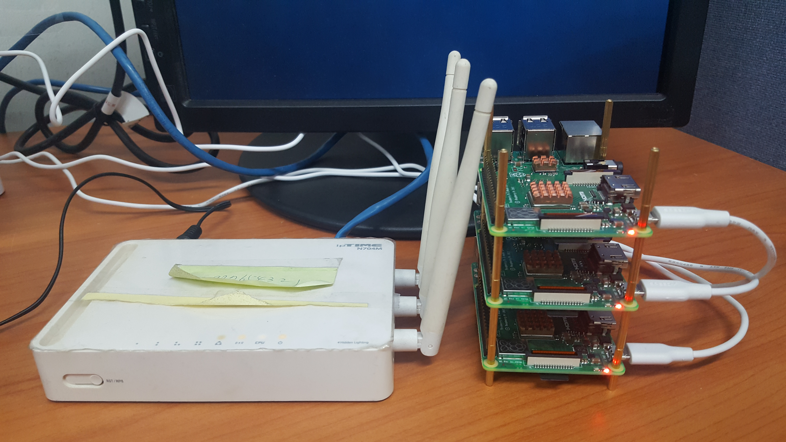
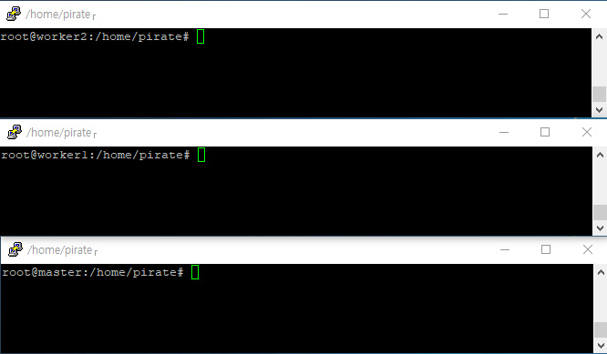

# rpi-docker-yolov2
In raspberry pi, How set the cluster with the docker and running yolov2-tiny-voc model

Environment is cluster with 1 router and 3 raspberry pi(rpi) board used DHCP and port forwarding each rpi

## Flashing HypriotOS in SD card  for rpi
(HypriotOS Link : https://github.com/hypriot/image-builder-rpi/releases)
1. SDcard format -> tool : https://www.sdcard.org/downloads/formatter_4/
2. SDcard Flash -> tool : https://www.balena.io/etcher/
## wireless lan using and connect the remote pc




get the root access
change the hostname
```
$ vi /etc/hostname
```
open hostname configure file and rewrite
```
$ vi /etc/wpa_supplicant/wpa_supplicant.conf
```
enter the following syntax at the top
```
ctrl_interface=DIR=/var/run/wpa_supplicant GROUP=netdev
update_config=1
network={
	ssid = "$ssid"
	psk = "$pwd"
}
```
Last, set the static IP(DHCP) in router and port forwarding

## check docker version
already HypriotOS image has docker, we can see the docker version below cmd.
```
$ docker info
```
above section is same process with master node and worker node

## set the Jupyter notebook
best way is building new custom image for docker. this part I will rewrite in GCE with kubernetes engine demo.
I just use already build image. below is image for tensor + Jupyter.(Thank you romilly!)
Docker image resource : https://hub.docker.com/r/romilly/rpi-docker-tensorflow
but this file has too low version python. so, if you don't want this image, you can find another image in DockerHub(https://hub.docker.com/) or build custom image
```
$docker run -it -p 8888:8888 -v ~/myNotebooks:/notebooks/myNotebooks romilly/rpi-docker-tensorflow
```
We can connect to rpi on the development PC.
For using the browser in same wireless lan
```
http://(DHCP rpi IP):8888/tree#notebooks
```
then, we can use the Jupyter environment

below all setting In the Jupyter Notebook terminal
## using YOLO in darknet
```
$sudo apt-get update
$sudo apt-get install git wget
$cd ./myNotebook
$git clone https://github.com/pjreddie/darknet.git
$cd darknet
$make
```
then, darknet is build in Linux system. (if make cmd is not working, we need apt-get install build-essnetial) 
```
$wget https://pjreddie.com/media/files/yolov2-tiny-voc.weights
```
- test

In the Jupyter Notebook terminal,
```
$ ./darknet detect cfg/yolov2-tiny-voc.cfg yolov2-tiny-voc.weights data/dog.jpg
```
then working process is printed out and in root we can see the prediction picture named prediction.jpg

